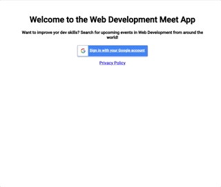

# WebDevMeetUp APP

WebDevMeetUp APP is a serverless, progressive web application (PWA) built with React using a test-driven development technique. It uses [Google Calendar API](https://developers.google.com/calendar) to fetch upcoming events for the community of web developers and it can be downloaded for offline use.

With this app, users can search for a city and view a list of upcoming events in that city. The app also allows users to view charts displaying the amount of events that will take place on certain days and the percentage of events to take place divided by subjects.


**See the hosted application [here](https://tanimaraeliassantos.github.io/webdevmeetup/).**



## Start the App

### Install dependencies

```bash
npm install
```

### Run

```bash
npm run start
```

### Deploy

```bash
npm run deploy
```

## Features

- Allows users to filter events by city
- Allows users to show/hide event details
- Allows users to specify number of events
- Allows users to use the app when offline
- Allows users to add an app shortcut to their home screen
- Allows users to view chat showing numbers of upcoming events by city

## Technologies

- React application with React framework
- Google Calendar API and OAuth2 authentication flow
- AWS Lambda serverless functions
- Recharts

### Author

[Tanimara Elias Santos](https://github.com/tanimaraeliassantos)

### Version

1.0.0
